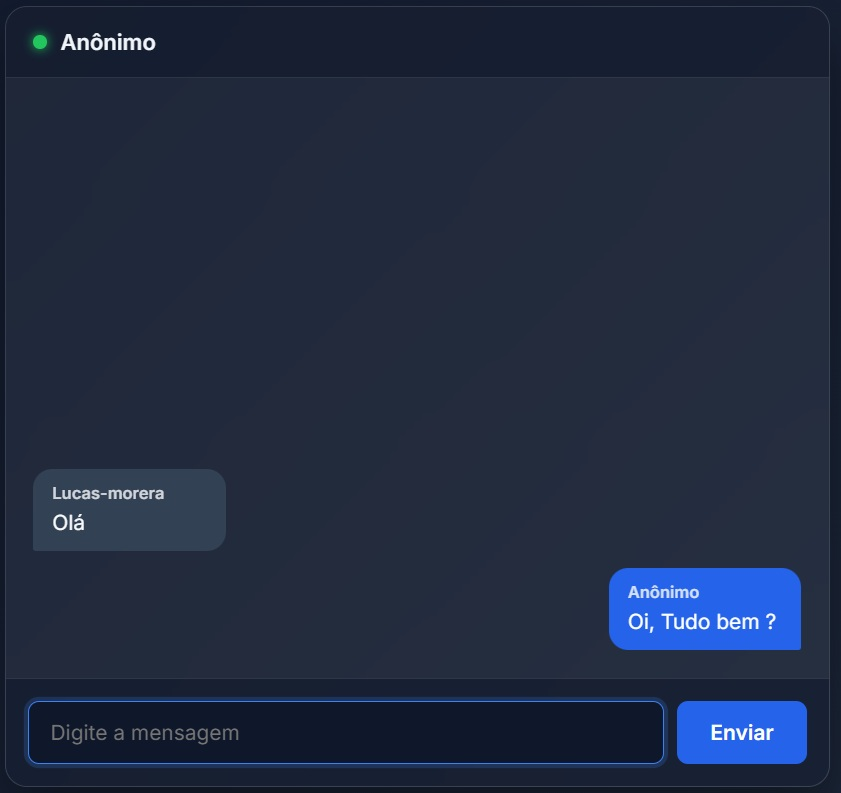

# 💬 Chat em Tempo Real com Node.js

Um aplicativo de bate-papo dinâmico e em tempo real para redes locais, desenvolvido com Node.js e WebSockets.



---

## 🚀 Como Executar o Projeto

### 1. Pré-requisitos
Certifique-se de ter o [Node.js](https://nodejs.org/) instalado em sua máquina.

### 2. Instalar as Dependências
Abra o terminal na pasta do projeto e instale os pacotes necessários:

```bash
npm install
